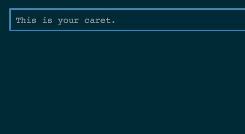

# jQuery Custom Caret

A jQuery plugin for customizing your caret (text cursor) using CSS.



## Tutorial

See `example/example.html` for a full example.

1. Make a `contenteditable` element, e.g. a `<div>`:

	```
	<div id="demo" contenteditable="true"></div>
	```
	
2. Apply custom caret on it:

	```
	$("#demo").customCaret();
	```
	
3. Add CSS:

	```
	#demo {
		/* Set text color to transparent to hide the default caret */
		color: transparent;

		/* Use text-shadow to make text visible */
		text-shadow: 0 0 white;
	}
	
	/* Customize the look of your caret */
	#caret {
		border-right: 0.5em solid white;
		margin-right: -0.5em;
		animation: blink-animation 1s steps(2, start) infinite;
	}
	@keyframes blink-animation {
		to {
			visibility: hidden;
		}
	}
	```
	
## Usage

	$("yourContentEditableElement").customCaret({
		caretID: _caretID_,
		callback: _callbackFunction_
	});
	
A `<span id= _caretID_ ></span>` element will be insert into the `contenteditable` element as your custom caret. You can adjust the look of it using CSS.

The default ID is `#caret`. You can also give your own ID:

	$("#demo").customCaret({caretID: "myCaret"});

## Limit

- Does not handle line break
- Does not work on Microsoft Edge